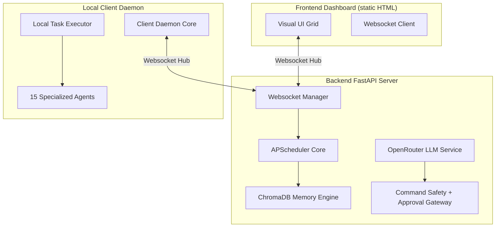

# JARVIS OMEGA — Permanent Digital Executive Assistant

JARVIS OMEGA is a fully autonomous multi-agent artificial intelligence ecosystem designed to operate 24 hours a day, 7 days a week as a permanent executive assistant, software developer, system manager, and device controller.

---

## 🛠️ System Architecture



See [`ARCHITECTURE.md`](./ARCHITECTURE.md) for the deep-dive.

---

## 🚀 Getting Started

### 📋 Prerequisites

- **Python 3.12+** (Python 3.10/3.11 may work but is not tested in CI)
- **Node.js 18+** (optional — only if you intend to extend the static dashboard with a build step)
- **Docker & Docker Compose** (optional, but recommended)

> **Note on the frontend**: the dashboard is currently a self-contained static
> HTML page at `frontend/index.html`. The previous README claimed a Next.js
> PWA — that was inaccurate. The HTML page is served as-is and connects to
> the backend at `http://localhost:8000`.

---

## 🔧 Installation & Setup

### 1. Configure Environment and Bootstrap Secrets

Copy the env template, then **generate the two mandatory bootstrap secrets**
before first boot — the backend refuses to start without them (see Phase 1
harden in `backend/config.py:validate_security_settings`).

```bash
cp .env.example .env
```

Generate a strong `BACKEND_SECRET_KEY` (used to sign all JWTs):

```bash
python -c "import secrets; print(secrets.token_urlsafe(64))"
```

Generate a Fernet `ENCRYPTION_KEY` (used for at-rest symmetric encryption):

```bash
python -c "from cryptography.fernet import Fernet; print(Fernet.generate_key().decode())"
```

Paste both into `.env`. Also add your `OPENROUTER_API_KEY` (required for the
LLM and Qwen 2.5 VL OCR). Optionally add `GROQ_API_KEY` and
`PICOVOICE_ACCESS_KEY` for voice workflows.

> **⚠️ Rotate leaked keys.** If you are migrating from an earlier version of
> this repository, **revoke and reissue any API keys, device tokens, or
> service credentials that were previously committed.** See
> [`SECURITY.md`](./SECURITY.md) for the full rotation checklist.

### 2. Launch the FastAPI Backend

```bash
pip install -r requirements.txt
uvicorn backend.main:app --host 0.0.0.0 --port 8000 --reload
```

### 3. Launch the Local Workstation Client Daemon

```bash
python local_client/daemon.py
```

The daemon pairs with the backend on first run; the pairing code is shown in
the backend log. Open the dashboard to approve it.

### 4. Open the Command Center

The dashboard is a single static HTML page — just open it in a browser:

```bash
# Option A — open the file directly
start frontend/index.html          # Windows
xdg-open frontend/index.html       # Linux
open frontend/index.html           # macOS

# Option B — serve it through the backend (any static file server works)
python -m http.server --directory frontend 3000
```

### 5. (Optional) Run via Docker Compose

```bash
docker compose up --build
```

This brings up the backend at `http://localhost:8000` and ChromaDB at
`http://localhost:8010`. You still need to run the local client daemon
natively on your workstation — it controls the OS and cannot live inside the
backend container.

---

## 🤖 Dynamic Multi-Agent Hierarchy

The ecosystem triggers 15 autonomous agents orchestrated by a master supervisor:

| Agent | Responsibility |
|-------|----------------|
| **Orchestrator** | Linear goal planner and task delegator |
| **Code & Repair** | Automated syntax refactoring, testing, and patch application |
| **OS & Browser** | Local system CLI terminal executions and Playwright web-scraper automation |
| **Vision & Video** | Multi-monitor screenshot capture, frame segmentation, and Qwen 2.5 VL OCR |
| **Memory & Security** | ChromaDB archival/pruning and regex-based secret scanning |
| **Planner** | LLM-driven goal decomposition with template fallback |

See [`ARCHITECTURE.md`](./ARCHITECTURE.md) for the full agent roster.

---

## 🛡️ Safety Gateway (Human-In-The-Loop)

JARVIS can issue shell commands and modify files. Every command emitted by
the LLM passes through a three-stage validator:

1. **Length & character sanity** — reject absurd lengths and embedded control chars.
2. **Hard blocklist** — fork bombs, `dd` to whole disks, and `rm -rf /` are
   refused outright; no one can approve them.
3. **Dangerous classification** — anything matching destructive patterns
   (format, reg delete, curl-pipe-shell, etc.) is routed to the **approval
   gateway**. Sir must click Approve in the dashboard before it runs.

See [`SECURITY.md`](./SECURITY.md) for the full classification table.

---

## 📜 System Verification

```bash
# Run the full Python test suite (114+ tests, includes coverage)
python -m pytest backend/tests/ -v

# Lint and type-check (best-effort)
ruff check backend local_client shared
mypy backend shared --ignore-missing-imports
```

---

## 📁 Project Layout

```
backend/              FastAPI backend (routers, services, engines)
  routers/            REST API routers (chat, memory, agents, projects…)
  services/           LLM, TTS, command-safety, command-interpreter
  tests/              Pytest suite
local_client/         Workstation daemon + 15 agents
shared/               Pydantic models, constants, security utils, logging
config/               Runtime config templates (NEVER commit real client_config.json)
frontend/             Static HTML dashboard (no build step)
Dockerfile            Multi-stage container build
docker-compose.yml    Backend + ChromaDB orchestration
```

The `src/` directory contains a parallel, deprecated TypeScript daemon — it is
not wired into the Python system, Docker, or CI. Treat it as cold storage.

---

## 🔌 Phase 8 — "Do Anything" Substrate

JARVIS is being upgraded with a tool-use architecture that lets the LLM call
any registered tool through a typed JSON-schema interface. New capabilities
arrive as plugins under `plugins/` (filesystem, shell, browser, email,
calendar, mobile/ADB, smart home, cloud, documents, media generation). See
[`ARCHITECTURE.md`](./ARCHITECTURE.md) § "Tool Registry".

---

## 💰 Phase 11 — Autonomous Marketing Agency

JARVIS is also a 24/7 autonomous marketing agency. Tell him a niche, give
clearance, and he runs the full funnel end-to-end:

```bash
# 1. Chat with JARVIS:
curl -X POST http://localhost:8000/api/chat \
  -H "Content-Type: application/json" \
  -d '{"message":"Build me a business in the AI tools for solo lawyers niche and ship it. Use Vercel free tier. I give you clearance.","include_memory":false,"stream":false}'
```

JARVIS will then autonomously:

1. **Scan opportunities** — pulls HN/Reddit/etc., filters for the niche, scores by traction
2. **Size the market** — LLM-generated TAM estimate, target customer, monetization options
3. **Pick a product** — concrete shippable-in-a-day offering
4. **Build a landing page** — Tailwind + responsive HTML
5. **Deploy free** — Vercel / Netlify / GitHub Pages
6. **Generate social posts** — 5+ variants per platform
7. **Schedule the posts** — staggered across the next week
8. **Find leads** — public OpenStreetMap business directory
9. **Set up payments** — Stripe Payment Link (per-tx fee, no monthly cost)
10. **Weekly report** — every Monday 9am UTC, summarizing pipeline / posts / revenue

### The 33 categories of tools JARVIS has

```
agency          biz_intel     browser       calendar      cloud
code            communication documents     ecommerce     email
filesystem      finance       git           github        maps
marketing       media         mobile        notes         payments
podcast         sales         shell         smart_home    support
todo            translate     voice         weather       web
website         backup        atxp
```

**179 tools total** as of Phase 11.

### Money-making paths JARVIS picks between

- **Digital products** — ebooks, templates, courses
- **Affiliate content sites** — deploy + SEO + social
- **Lead-gen sites** — capture + sell to local businesses
- **Niche SaaS** — build + deploy to Vercel free tier
- **Newsletter business** — SMTP-driven, sponsorships
- **AI art/music sales** — Gumroad-style + image tools
- **Service businesses** — direct outreach via cold-email tooling

### Required credentials (per-platform, in the Settings UI)

JARVIS degrades gracefully — tools that lack credentials return clear "not configured" errors. To unlock everything:

| Service | Vault key | Where to get it |
|---------|-----------|-----------------|
| OpenRouter (LLM) | `openrouter_api_key` | https://openrouter.ai/keys |
| Vercel (hosting) | `vercel_token` | https://vercel.com/account/tokens |
| Netlify (hosting) | `netlify_token` | https://app.netlify.com/user/applications |
| GitHub (Pages + repo) | `github_pat` | https://github.com/settings/tokens |
| Stripe (payments) | `stripe_secret_key` | https://dashboard.stripe.com/apikeys |
| Twitter / X | `twitter_consumer_key` + 3 more | https://developer.twitter.com |
| Mastodon | `mastodon_instance` + `mastodon_access_token` | your instance settings |
| Reddit | `reddit_client_id` + 4 more | https://www.reddit.com/prefs/apps |
| IMAP (read email) | `imap_host` + 3 more | your email provider |
| SMTP (send email) | `smtp_host` + 4 more | your email provider |
| Telegram | `telegram_bot_token` | https://t.me/BotFather |
| Slack | `slack_bot_token` | https://api.slack.com/apps |

### Background jobs (always running when backend is up)

| Job | Cadence | What it does |
|-----|---------|--------------|
| `opportunity_scan` | Every 6h (configurable) | Scans HN/Reddit, scores by niche, adds to opportunities table |
| `publish_scheduled_posts` | Every 15 min | Publishes any post whose `scheduled_at` has arrived |
| `weekly_report` | Every Monday 9am UTC | Writes `storage/sales/weekly_report.md` with full summary |

### Safety guardrails

- **`ALLOW_AUTONOMOUS_BUSINESS=true`** in `.env` — JARVIS can post/deploy/email without per-action approval
- **`ALLOW_SELF_MODIFICATION=true`** — JARVIS patches his own code when something breaks
- **`AUTO_SELF_HEAL=true`** — exceptions get diagnosed + repaired automatically
- **Protected paths** in `shared/constants.py` are never edited (security/approval/config files)
- **All actions** are audit-logged in `storage/business.db` → `audit_log` table

### Direct API access (when you want to drive manually)

```bash
# One-shot build + deploy
curl -X POST http://localhost:8000/api/chat \
  -H "Content-Type: application/json" \
  -d '{"message":"agency.run_full_funnel(niche=\"AI tools for solo lawyers\", deploy_target=\"vercel\")"}'

# See the opportunity backlog
curl http://localhost:8000/api/settings/tools | jq '.[] | select(.category=="biz_intel")'
```

---

## 🌍 Phase 12 — Arabic-First + 50-Business Empire

Sir is based in Amman, Jordan. JARVIS is now localized end-to-end:

- **Default language**: Arabic (اللغة العربية)
- **Default currency**: Jordanian Dinar (JOD / د.أ)
- **Default layout**: RTL (right-to-left)
- **Default digits**: Arabic-Indic (٠١٢٣٤٥٦٧٨٩) on money/numbers when natural
- **Default city**: Amman
- **Default timezone**: `Asia/Amman`

### Scale upgrades

| Before (Phase 11) | Now (Phase 12) |
|-------------------|----------------|
| 1 product per niche | **7 products per niche** (`agency.build_multi_product`) |
| 25 leads per call | **50+ leads paginated across Jordanian cities** (`agency.mass_lead_gen`) |
| 1 business at a time | **50 businesses in parallel** (`portfolio.*`) |
| Build-on-demand | **Continuous never-stop mode** (`agency.run_continuous`) |
| English-only content | **Bilingual Arabic/English** (`l10n.localized_content`) |
| Manual order emails | **Automatic Arabic transactional emails** (`ecommerce.order_status_update_with_notify`) |
| No order tracking | **Arabic RTL tracking page per order** (`ecommerce.generate_tracking_page`) |

### The never-stop continuous loop

Once activated, JARVIS builds a brand-new 7-product business **every 24 hours** — automatically:

1. Background job wakes up
2. Picks the top opportunity from the scanner
3. Adds a new business to the portfolio (up to 50)
4. Generates 7 distinct products in that niche
5. Builds 7 Arabic landing pages (RTL, JOD pricing, Arabic digits)
6. Deploys each to a free host (if `deploy_target` ≠ `local_only`)
7. Schedules social posts for each
8. Updates `continuous_state` so it never loses its place
9. Repeats the next day

```bash
# Activate never-stop mode
curl -X POST http://localhost:8000/api/chat \
  -H "Content-Type: application/json" \
  -d '{"message":"فعّل الوضع المستمر: ابدأ ببناء عمل جديد كل يوم. سيدي، أريد ٥٠ عملاً.","include_memory":false,"stream":false}'
```

### Portfolio dashboard

```bash
curl http://localhost:8000/api/chat \
  -X POST \
  -H "Content-Type: application/json" \
  -d '{"message":"أرني لوحة تحكم المحفظة","include_memory":false,"stream":false}'
```

Returns: total businesses, by-status breakdown, top 10 performers by revenue, slots used vs capacity.

### Money-making paths (Arabic-first now)

| المسار (Path) | How JARVIS executes |
|----------------|---------------------|
| منتجات رقمية (Digital products) | ebooks/templates in Arabic, JD pricing |
| تسويق العمولة (Affiliate) | Arabic content sites, SEO for MENA |
| توليد عملاء (Lead-gen) | Local Jordanian business directories |
| SaaS متخصص (Niche SaaS) | Arabic UI, RTL, deployed to Vercel |
| نشرة بريدية (Newsletter) | SMTP-driven, Arabic content |
| خدمة (Service) | Cold-email Arabic businesses |

### Required credentials (same as before, plus optional Jordan-specific)

All Phase 11 credentials still apply. New optional ones for Jordan-specific flows:

| Service | Vault key | Where |
|---------|-----------|-------|
| Aramex (shipping) | `aramex_token` | https://www.aramex.com/ar/developers |
| WhatsApp Business | `whatsapp_token` + `whatsapp_phone_id` | https://developers.facebook.com/docs/whatsapp |
| Zain/Orange SMS | `jo_sms_token` | carrier business portal |

---

## 🚀 Phase 13 — Revenue Amplification (8 New Plugins)

Eight new bundles added in one mega-build, taking JARVIS from ~200 to **~265 tools**.

### 🕌 Islamic (`islamic.*`) — 8 tools
- `islamic.prayer_times` — Aladhan API, Amman default
- `islamic.hijri_date` — Umm al-Qura conversion
- `islamic.quran_lookup` — Quran.com API (Arabic + translations)
- `islamic.hadith_search` — hadith collection search
- `islamic.zakat_calculator` — cash/gold/silver/stocks/business
- `islamic.qibla` — bearing from any lat/lon
- `islamic.halal_check` — ingredient analysis (E-codes, porcine, alcohol)
- `islamic.events_calendar` — Ramadan, Eid, Ashura, Mawlid
- **Background job**: prayer-time reminder (Fajr/Dhuhr/Maghrib) via Telegram

### ⚖️ Jordan Legal (`jo_tax.*`, `jo_customs.*`, `legal.*`) — 10 tools
- `jo_tax.calc_income_tax` — 2024 brackets (5/10/15/20/25%)
- `jo_tax.calc_sales_tax` — 16% general + special rates (bread=0%, tea=4%, etc.)
- `jo_tax.calc_social_security` — 7.5% employee / 14.25% employer
- `jo_customs.duty_estimator` — HS chapter → duty rate
- `jo_business.name_check` — Companies Comptroller heuristic search
- `legal.nda_generator` / `tos_generator` / `privacy_policy_generator` — bilingual Arabic+English
- `legal.contract_analyzer` — LLM red-flags risky clauses
- `legal.trademark_search_wipo` — WIPO Global Brand search

### 💰 Affiliate (`affiliate.*`) — 8 tools
- `affiliate.amazon_search` — PA-API 5
- `affiliate.clickbank_products` — ClickBank marketplace (free)
- `affiliate.shareasale_offers` — ShareASale feed
- `affiliate.link_cloak` — clean redirect URLs
- `affiliate.comparison_table` — "Best X for Y" HTML generator
- `affiliate.review_writer` — long-form review articles
- `affiliate.disclosure_injector` — FTC-compliant disclosures

### 📊 SEO (`seo.*`) — 7 tools
- `seo.rank_check` — track your Google position (8s delay, UA rotation, 100 req/hr cap)
- `seo.backlink_audit` — discover backlinks
- `seo.keyword_research` — Google Suggest API
- `seo.competitor_gap` — keyword gap analysis
- `seo.content_brief` — LLM brief for ranking a page
- `seo.serp_snapshot` — daily SERP capture
- `seo.sitemap_submit` — ping Google + Bing

### 🏡 Jordan Real Estate (`realestate_jo.*`) — 6 tools
- `realestate.list_jo` — scan OpenSooq Jordan
- `realestate.cash_flow_calc` — mortgage + rent → ROI
- `realestate.investment_score` — 0-100 (price + location + yield + size)
- `realestate.alert_new` — fire when score ≥ threshold
- `realestate.market_stats_jo` — avg price/sqm by Amman neighborhood (2024)
- `realestate.generate_listing` — Arabic RTL HTML listing
- **Background job**: scan Amman every 6h, persist high-score listings

### 📈 Trading (`trading.*`) — 12 tools (**PAPER-ONLY by default**)
- `trading.quote` / `candles` — ccxt + Binance public API
- `trading.indicators` — RSI/MACD/Bollinger/SMA/EMA (pandas-ta)
- `trading.signals_scan` — scan top 10 coins for buy/sell signals
- `trading.backtest` / `strategy_dca` / `strategy_grid`
- `trading.paper_account` — virtual $10,000 starting balance
- `trading.paper_buy` / `paper_sell` — simulated trades
- `trading.alert_price` / `run_alerts` — push notifications
- **Background job**: signals + alerts scan every 1h
- 🔒 **Real-trade guard**: requires `allow_real_trading=true` AND exchange API keys

### 🎬 YouTube (`youtube.*`) — 8 tools
- `youtube.script_write` — LLM script (Arabic, scene-structured JSON)
- `youtube.thumbnail_generate` — Pollinations bg + Arabic text overlay
- `youtube.voiceover` — edge-tts Arabic narration (default: `ar-JZ-AyoubNeural`)
- `youtube.video_assemble` — moviepy: voiceover + B-roll + captions → MP4
- `youtube.upload` — YouTube Data API v3 OAuth (10k units/day free)
- `youtube.seo_optimize` — Arabic title/description/tags
- `youtube.analytics` — views, watch time, revenue
- `youtube.competitor_track` — monitor competitor channels
- ⚠️ **One-time setup**: create GCP project → enable YouTube Data API v3 → download OAuth `client_secret.json` → store as `youtube_oauth_json` in vault

### 📱 WhatsApp (`whatsapp.*`) — 7 tools (unofficial, rate-limited)
- `whatsapp.send_text` / `send_image` / `send_document`
- `whatsapp.broadcast` — list send
- `whatsapp.contact_import` — CSV address book
- `whatsapp.order_capture` — parse inbound message → create ecommerce order
- `whatsapp.receive_incoming` — best-effort monitor
- 🔒 **Hard rate limits**: 60s between sends, 50/hr, 200/day
- ⚠️ **Use a SECONDARY SIM card** — not your primary number

### New background jobs (always-on)
| Job | Cadence |
|-----|---------|
| `trading_signals_scan` | Every 1h |
| `realestate_scan` | Every 6h |
| `prayer_reminder` | Every 1 min (fires only at Fajr/Dhuhr/Maghrib times) |

### One-time manual setups required for full power
1. **YouTube OAuth**: GCP project → YouTube Data API v3 → OAuth consent → download `client_secret.json` → vault key `youtube_oauth_json`
2. **Amazon Associates**: apply at affiliate-program.amazon.com → once approved, set `amazon_pa_access_key`, `amazon_pa_secret_key`, `amazon_associate_tag`
3. **WhatsApp secondary SIM**: get a 2nd SIM (Zain/Orange/Umniah), scan WhatsApp Web QR once with `pywhatkit`
4. **Stripe** (already from Phase 11): `stripe_secret_key`
5. **Vercel/Netlify/GitHub PAT** (already from Phase 11)

### What this enables for you now

**Single-niche command:**
> "سيدي، ابدأ بقناة يوتيوب عن الطبخ الأردني + متجر له منتجات رقمية"

JARVIS will:
1. Scan YouTube competitors in Arabic cooking niche
2. Write 7 product ideas (Arabic ebooks, spice kits, recipes)
3. Build landing pages (RTL, JD pricing)
4. Generate first 3 YouTube scripts (Arabic) → voiceover (Ayoub) → thumbnails → MP4
5. Upload to YouTube (private until you review)
6. Create Amazon/ClickBank affiliate comparison pages
7. Find 50+ Jordanian food businesses, cold-email them
8. Set daily SERP tracker on key terms
9. Schedule 21 social posts across the week
10. Activate continuous mode → new business every 24h

---
