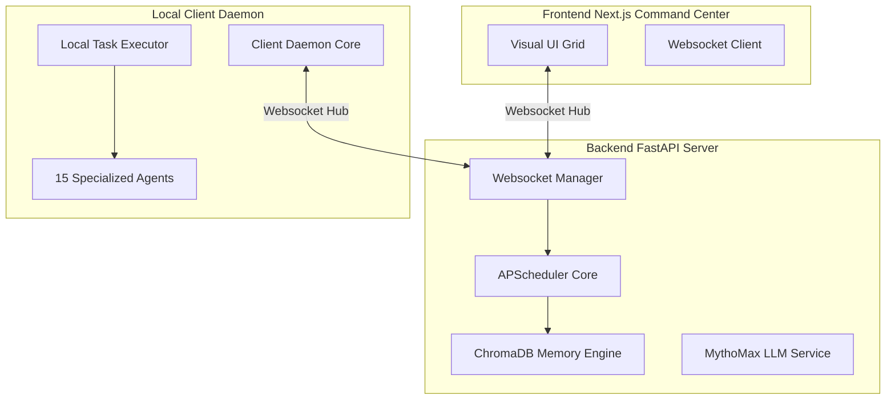

# JARVIS OMEGA — Permanent Digital Executive Assistant

JARVIS OMEGA is a fully autonomous multi-agent artificial intelligence ecosystem designed to operate 24 hours a day, 7 days a week as a permanent executive assistant, software developer, system manager, and device controller.

---

## 🛠️ System Architecture



---

## 🚀 Getting Started

### 📋 Prerequisites
- **Python 3.10+**
- **Node.js 18+ & npm**
- **Docker & Docker Compose** (Optional)

---

## 🔧 Installation & Setup

### 1. Configure Environments
Copy the environment variables template and configure your API keys:
```bash
cp .env.example .env
```
Ensure your `OPENROUTER_API_KEY`, `GROQ_API_KEY`, and Picovoice details are active inside your `.env` file.

### 2. Launch FastAPI Backend Core
Install Python dependencies and start the Uvicorn webserver:
```bash
pip install -r requirements.txt
uvicorn backend.main:app --host 0.0.0.0 --port 8000 --reload
```

### 3. Launch Local Workstation Client Daemon
Start the client listener daemon to begin executing autonomous agent tasks:
```bash
python local_client/daemon.py
```

### 4. Run Command Center PWA Frontend
Boot up the Next.js React client dashboard:
```bash
cd frontend
npm install
npm run dev
```
Open `http://localhost:3000` to inspect vitals, stream terminals, query vector spaces, and approve agent actions.

---

## 🤖 Dynamic Multi-Agent Hierarchy
The ecosystem triggers 15 autonomous agents orchestrated by a master supervisor:
- **Orchestrator**: Linear goal planner and task delegator.
- **Code & Repair**: Automated syntax refactoring, testing, and patch application.
- **OS & Browser**: Local system CLI terminal executions and Playwright web scrapper automation.
- **Vision & Video**: Multi-monitor screenshot capture, frame segmentation, and Qwen 2.5 OCR reviews.
- **Memory & Security**: Near-duplicate log pruning and workspace credentials secret scanner.

---

## 🛡️ Security Gateway (Human-In-The-Loop)
Dangerous operating system actions (e.g., directory deletions, file modifications) undergo risk assessments and register active approval blocks. Agents suspend operations until Sir grants permission from the Command Center gateway dashboard.

---

## 📜 System Verification
To verify code syntax compiles cleanly, execute tests:
```bash
python -m pytest backend/tests/
```
Verify that the Next.js production code bundles without warning:
```bash
cd frontend
npm run build
```
